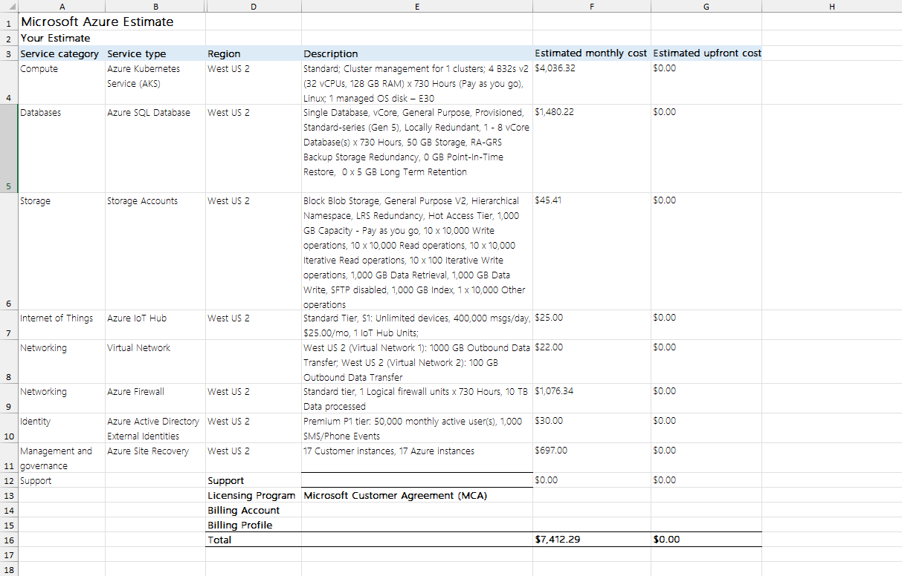

# Stratégie de Migration Cloud & Analyse FinOps : OptiGreen

 

## 📋 Présentation du projet

Ce projet, réalisé dans le cadre de ma certification Data Engineer, simule une mission de **consulting en architecture cloud**. Le client, *OptiGreen Solutions* (entreprise d'énergies renouvelables), souhaite migrer son infrastructure informatique interne (On-Premise) vers le cloud pour gagner en scalabilité, sécurité et agilité.

Mon rôle a été d'auditer l'infrastructure existante, de comparer les fournisseurs cloud (Benchmark), de concevoir une architecture **Cloud Native** sur Microsoft Azure et de réaliser une estimation financière précise (FinOps).

> **Note :** Ce projet démontre ma capacité à analyser des besoins infrastructurels et à concevoir des solutions Azure adaptées aux contraintes d'entreprise (Coûts, Sécurité, Haute Disponibilité).

## 🎯 Objectifs Pédagogiques

*   **Audit d'infrastructure :** Cartographier les données et les serveurs existants.
*   **Architecture Cloud :** Concevoir une solution cible (PaaS/SaaS) plutôt qu'un simple "Lift & Shift".
*   **Benchmark :** Comparer Azure, AWS et GCP sur des critères techniques et financiers.
*   **FinOps :** Calculer le TCO (Total Cost of Ownership) et optimiser les coûts mensuels.
*   **Sécurité :** Proposer une stratégie de sécurisation (Firewall, Identity Management).

## 🛠 Outils et Technologies

*   **Cloud Provider :** Microsoft Azure.
*   **Services Azure proposés :** Azure Kubernetes Service (AKS), Azure SQL Database, Azure IoT Hub, Azure Blob Storage, Azure Active Directory.
*   **Outils d'analyse :** Azure Pricing Calculator, Microsoft Excel (TCO), Azure Migrate (analyse théorique).
*   **Concepts clés :** Cloud Native, FinOps, SLA, Disaster Recovery (Azure Site Recovery).

## 📊 Architecture et Stratégie de Migration

### 1. Diagramme de Migration (On-Premise vers Azure)

```mermaid
graph LR
    %% Define Styles
    classDef azure fill:#0078D4,stroke:#004C87,stroke-width:2px,color:#fff,rx:5,ry:5;
    classDef onprem fill:#505050,stroke:#333,stroke-width:2px,color:#fff,rx:5,ry:5;
    classDef hidden width:0px,height:0px,fill:none,stroke:none,color:transparent;

    %% LEFT COLUMN: ON-PREMISE
    subgraph On_Premise ["🏢 Infrastructure Actuelle (On-Premise)"]
        direction TB
        %% Invisible Spacer to push content down
        Space1[ ]:::hidden
        
        %% Nodes
        ServerApp["17 VMs Application"]:::onprem
        DB_SQL["SQL Server / MySQL"]:::onprem
        NAS["NAS Stockage Fichiers"]:::onprem
        IoT_Local["Serveur NodeJS Local"]:::onprem
        Network_Local["MPLS & Fortigate FW"]:::onprem
        
        %% Vertical Stack inside the column
        Space1 ~~~ ServerApp ~~~ DB_SQL ~~~ NAS ~~~ IoT_Local ~~~ Network_Local
    end

    %% RIGHT COLUMN: AZURE
    subgraph Azure_Target ["☁️ Cible : Azure Cloud Native"]
        direction TB
        %% Invisible Spacer to push content down
        Space2[ ]:::hidden

        %% Nodes
        AKS["Azure Kubernetes Service (AKS)"]:::azure
        AzSQL["Azure SQL Database"]:::azure
        Blob["Azure Blob Storage"]:::azure
        IoTHub["Azure IoT Hub"]:::azure
        AzNet["Azure VNet + Azure Firewall"]:::azure

        %% Vertical Stack inside the column
        Space2 ~~~ AKS ~~~ AzSQL ~~~ Blob ~~~ IoTHub ~~~ AzNet
    end

    %% MIGRATION LINKS (Left to Right)
    ServerApp -->|Migration| AKS
    DB_SQL -->|Migration| AzSQL
    NAS -->|Migration| Blob
    IoT_Local -->|Refonte| IoTHub
    Network_Local -->|Sécurité| AzNet

    %% Subgraph Background Colors
    style On_Premise fill:#f4f4f4,stroke:#666,stroke-width:2px,color:#333
    style Azure_Target fill:#e6f7ff,stroke:#0078D4,stroke-width:2px,color:#0078D4
```

### 2. Audit de l'existant (On-Premise)
L'infrastructure de départ souffrait de rigidité et de coûts de maintenance élevés :
*   **Serveurs :** 24 VMs (Prod/Pré-prod) hébergées sur site.
*   **Données :** Bases SQL Server, MySQL et fichiers sur NAS.
*   **IoT :** Traitement local via serveur NodeJS (problème de scalabilité).
*   **Réseau :** MPLS coûteux et Firewalls physiques.### 1. Audit de l'existant (On-Premise)
L'infrastructure de départ souffrait de rigidité et de coûts de maintenance élevés :
*   **Serveurs :** 24 VMs (Prod/Pré-prod) hébergées sur site.
*   **Données :** Bases SQL Server, MySQL et fichiers sur NAS.
*   **IoT :** Traitement local via serveur NodeJS (problème de scalabilité).
*   **Réseau :** MPLS coûteux et Firewalls physiques.

### 3. Solution Recommandée : Azure Cloud Native
Au lieu de simplement copier les machines virtuelles (Lift & Shift), j'ai proposé une modernisation vers des services managés pour réduire la charge d'administration :

| Composant | Solution On-Premise | Solution Azure Cible | Avantage Admin |
| :--- | :--- | :--- | :--- |
| **Compute** | 17 VMs Applications | **Azure Kubernetes (AKS)** | Orchestration et scalabilité auto. |
| **Database** | SQL Server / MySQL | **Azure SQL Database** | Pas de gestion d'OS, backups auto. |
| **Fichiers** | Serveur NAS | **Azure Blob Storage** | Stockage illimité, Tiering (Hot/Cold). |
| **IoT** | Serveur NodeJS | **Azure IoT Hub** | Gestion de millions de messages/sec. |
| **Sécurité** | Firewalls Physiques | **Azure Firewall + AD** | Sécurité périmétrique Cloud. |

*(Voir le diagramme de flux ci-dessus pour la visualisation de la migration)*

## 💰 Analyse FinOps et Résultats

L'analyse financière a été réalisée via l'outil **Azure Pricing Calculator**.

*   **Estimation Mensuelle :** Environ **$7,412.29**.
*   **Optimisations proposées :**
    *   Utilisation d'instances réservées (Reserved Instances) pour les nœuds AKS (-30% à -50%).
    *   Mise en place de politiques de cycle de vie pour le stockage (Blob Storage Archive).
    *   Dimensionnement précis des DTU pour les bases de données SQL.

### Aperçu de l'estimation des coûts :

## 🚀 Ce que j'ai appris

Ce projet m'a permis de sortir du code pur pour comprendre la **vision globale d'un système d'information**. J'ai appris à :
1.  Traduire des besoins métiers (IoT, RH, Finance) en ressources techniques Azure.
2.  Justifier le choix d'une architecture Cloud Native face à un Lift & Shift.
3.  Utiliser les outils officiels de Microsoft pour chiffrer un projet de migration.
4.  Intégrer les contraintes de sécurité (VPN, Azure AD) dès la phase de conception.
