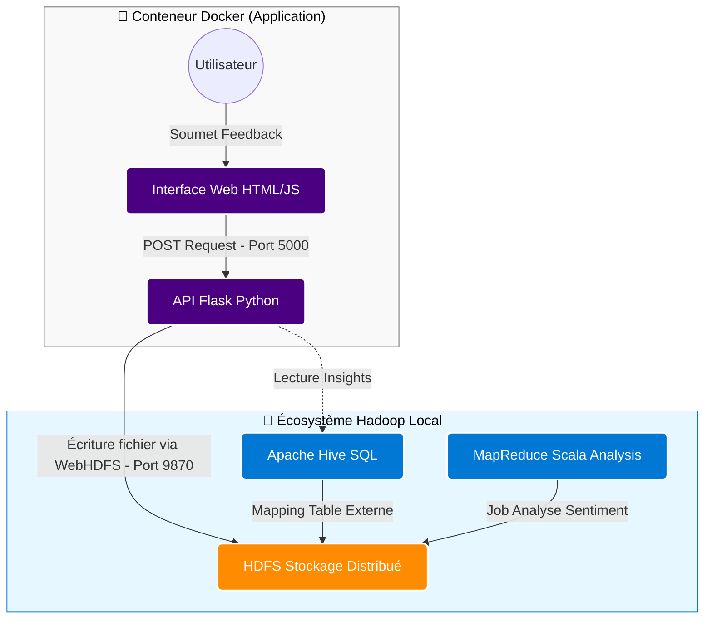
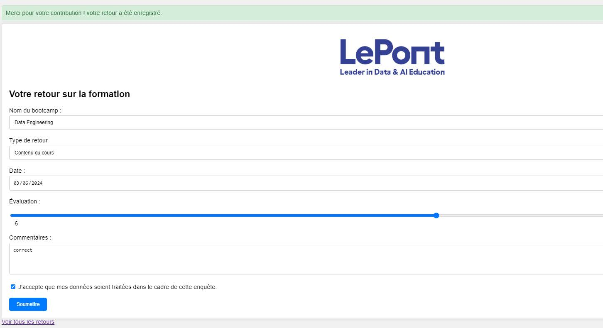
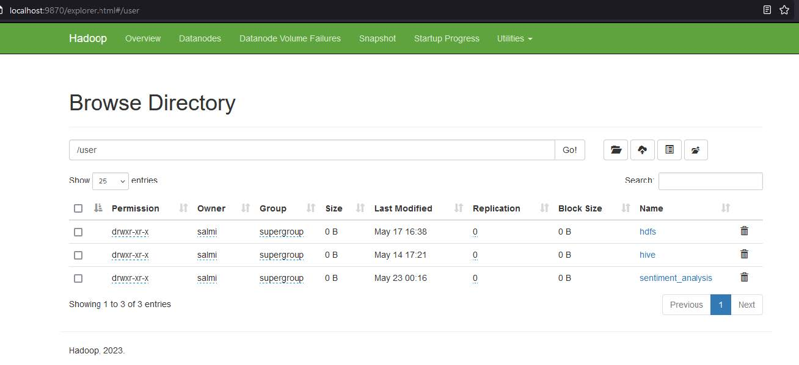
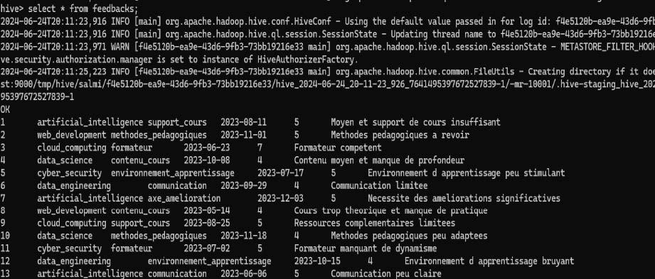
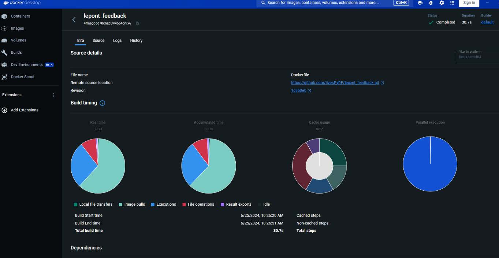
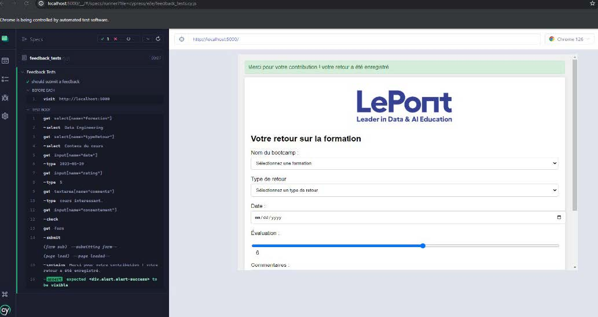

# Application Web & Pipeline Big Data : Analyse de Feedback

   

## 📋 Présentation du projet

Ce projet "Capstone" représente une **intégration système complète**. L'objectif était de construire une application web permettant aux étudiants de donner leur avis sur des cours, et de traiter ces données via un écosystème Big Data local.

Ce n'est pas seulement un projet de développement, mais un **défi d'architecture système**. Il a fallu interconnecter des environnements hétérogènes (Web App légère vs Infrastructure Hadoop lourde), gérer les réseaux Docker et orchestrer des flux de données automatisés.


## 🛠 Architecture et Flux de Données

L'architecture repose sur une communication entre un conteneur applicatif et un cluster de données local.




## 💻 Détails Techniques et Configuration

### 1. Backend Python (Intégration HDFS)
Le défi principal était de permettre à Python d'écrire dans un système de fichiers distribué (HDFS) sans passer par des commandes système locales, mais via le réseau. J'ai utilisé le client pywebhdfs pour interagir avec le NameNode.

Extrait : Logique d'écriture et gestion d'erreurs
```python
# Exemple de logique d'écriture dans HDFS
from pywebhdfs.webhdfs import PyWebHdfsClient
try:
    # Connexion au NameNode via WebHDFS
    hdfs = PyWebHdfsClient(host='host.docker.internal', port='9870', user_name='hdfs')
    hdfs.append_file('/user/hdfs/feedbacks.csv', data_to_append)
    
    # Message de succès (Flask flash)
    flash("Retour enregistré avec succès dans le Data Lake.", "success")
except Exception as e:
    # Gestion critique si HDFS est en Safe Mode ou inaccessible
    print(f"Erreur de connexion HDFS : {str(e)}")
    flash("Erreur serveur de stockage. Veuillez réessayer.", "danger")
```
    
### 2. Conteneurisation (Docker)
L'application web est conteneurisée pour garantir la portabilité et faciliter le déploiement.
Dockerfile utilisé :
```dockerfile
FROM python:3.12
WORKDIR /app
# Installation des dépendances
COPY requirements.txt .
RUN pip install -r requirements.txt
# Copie du code source
COPY . .
# Exposition du port Flask
EXPOSE 5000
# Commande de démarrage
CMD ["python", "app.py"]
```

### 3. Pipeline Big Data
* HDFS : Stockage distribué des fichiers .csv bruts.
* Apache Hive : Utilisation de Tables Externes pour appliquer un schéma SQL sur les données brutes de HDFS, permettant des requêtes d'analyse rapides.
* Scala (MapReduce) : Utilisation pour des jobs d'analyse de sentiment plus complexes sur le corpus de feedback.


## 🔧 Troubleshooting et Résolution de Problèmes
En tant qu'administrateur de cette stack, j'ai dû résoudre plusieurs incidents techniques majeurs durant le projet :

### 🔴 Problème 1 : HDFS en "Safe Mode"
* Symptôme : L'application Python plantait lors de l'écriture des fichiers. Erreur : NameNode is in safe mode.
* Analyse : HDFS se met en protection s'il manque des DataNodes ou si l'espace disque est critique.
* Résolution : Analyse des logs Hadoop, puis exécution de la commande d'admin : hdfs dfsadmin -safemode leave.

### 🔴 Problème 2 : Conflits de Ports (Docker vs Localhost)
* Symptôme : Le conteneur Docker n'arrivait pas à contacter le service Hadoop hébergé sur la machine hôte.
* Résolution : Configuration du réseau Docker. Utilisation de host.docker.internal (ou --network host) pour permettre au conteneur de " voir" le port 9870 de la machine hôte.

### 🔴 Problème 3 : Versions Java (Hive vs Hadoop)
* Symptôme : Hive refusait de démarrer (Stack Traces Java complexes).
* Cause : Incompatibilité entre les bibliothèques guava de Hadoop et celles de Hive.
* Résolution : Localisation des JARs conflictuels et remplacement manuel des fichiers .jar pour uniformiser les versions.


## 📸 Aperçu de l'Infrastructure
### 1. Interface Web Utilisateur
Le point d'entrée pour les utilisateurs.




### 2. Gestion du Cluster Hadoop
Vérification des fichiers stockés directement dans l'interface HDFS.




### 3. Exécution des requêtes Hive
Traitement des données via terminal SQL-like.




### 4. Déploiement Docker
Vérification du build et du run de l'image.




### 5. Test E2E avec Cypress
Mise en place de tests E2E avec Cypress pour valider la stabilité de l'application avant déploiement.




---


## 🚀 Bilan : Compétences SysAdmin / Cloud
Ce projet a renforcé mes compétences en :
* Administration Linux/Hadoop : Gestion des services (start-yarn, start-dfs), gestion des permissions utilisateurs HDFS.
* Virtualisation : Création et débogage de conteneurs Docker.
* Réseau Applicatif : Compréhension des flux HTTP REST et des connexions RPC Hadoop.
* QA & Testing : Mise en place de tests E2E avec Cypress pour valider la stabilité de l'application avant déploiement.
