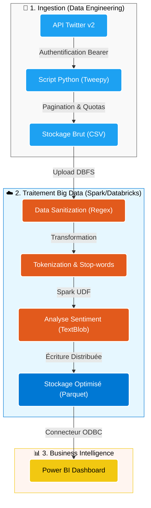
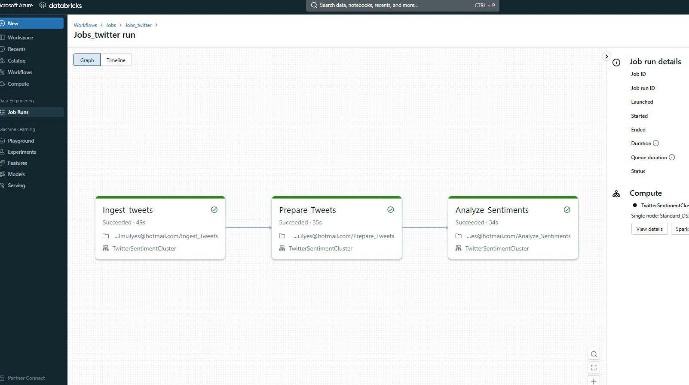
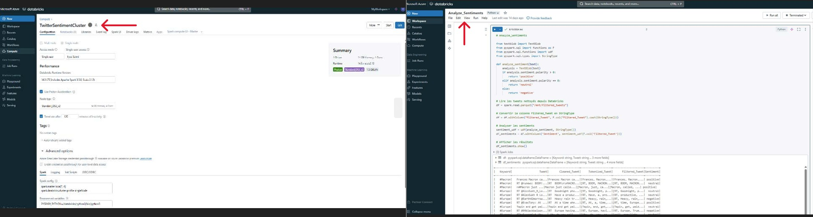
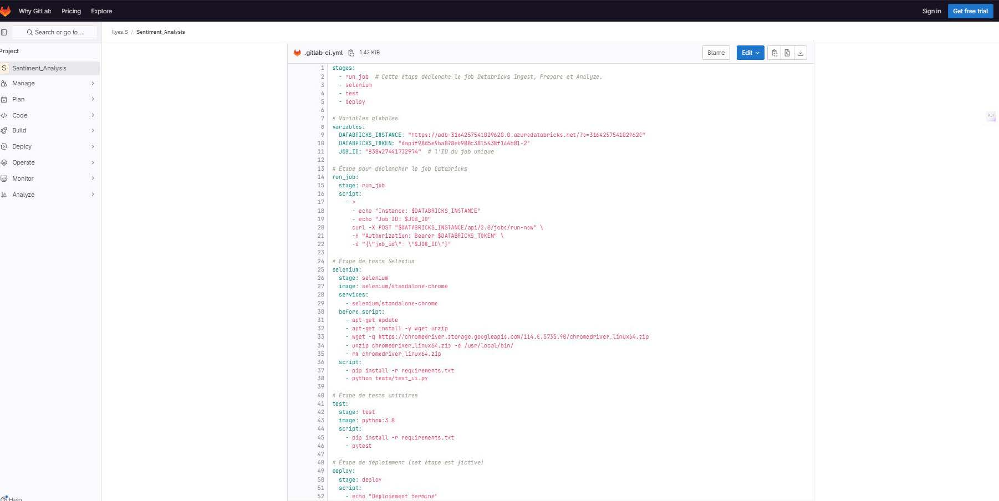
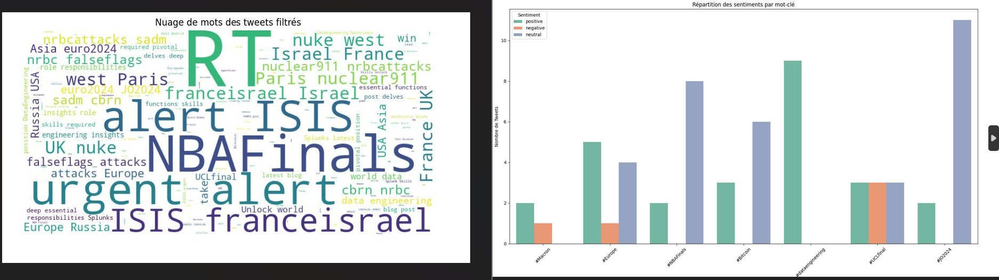

# Pipeline ETL End-to-End & DevOps sur Azure Databricks

   

## 📋 Résumé Exécutif

Ce projet démontre la conception et l'implémentation d'un **pipeline de données complet (End-to-End)** sur le cloud Microsoft Azure. L'objectif était d'ingérer des flux de données non structurées (Tweets), de les transformer via un traitement distribué (Spark NLP), et d'automatiser le cycle de déploiement via une approche **DevOps (CI/CD)**.

Ce projet met en avant une double compétence :
1.  **Data Engineering :** Développement de scripts Python/Spark robustes pour l'ingestion et l'analyse de sentiment.
2.  **Cloud Architecture :** Administration de clusters Databricks et orchestration de workflows automatisés.

## 🛠 Architecture Technique

Le pipeline intègre des composants d'ingestion, de traitement massif et de reporting.




## 💻 Implémentation Data Engineering

Les scripts complets sont disponibles dans ce dépôt : 
- Code source : [03-Pipeline-Azure-Databricks-CICD/src](./03-Pipeline-Azure-Databricks-CICD/src)
- Fichiers de configuration : [03-Pipeline-Azure-Databricks-CICD/config](./03-Pipeline-Azure-Databricks-CICD/config)

### 1. Ingestion de Données (Python & Tweepy)
J'ai développé une fonction robuste get_tweets qui gère la pagination, filtre les doublons via un set() d'IDs, et interroge l'API Twitter v2.

```python
# Extrait de collect_tweets.py
def get_tweets(keyword, max_results=10, lang='en', seen_ids=set()):
    try:
        response = client.search_recent_tweets(
            query=f"{keyword} lang:{lang}",
            max_results=max_results,
            tweet_fields=['context_annotations', 'created_at'],
            expansions=['author_id']
        )
        tweets = response.data
        new_tweets = []
        if tweets is not None:
            for tweet in tweets:
                # Déduplication basée sur l'ID du tweet
                if tweet.id not in seen_ids:
                    seen_ids.add(tweet.id)
                    new_tweets.append(tweet)
        return new_tweets
    except tweepy.TweepyException as e:
        print(f"Erreur API : {e}")
        return []
```

### 2. Prétraitement et Assainissement (Data Sanitization)
Le nettoyage utilise des expressions régulières complexes pour supprimer le bruit (URLs, mentions) et NLTK pour la tokenisation.

```Python
# Extrait de clean_tweets.py
def clean_tweet(tweet):
    # Suppression des URL
    tweet = re.sub(r"http\S+|www\S+|https\S+", '', tweet, flags=re.MULTILINE)
    # Suppression des mentions et hashtags
    tweet = re.sub(r'@\w+|#', '', tweet)
    # Suppression des caractères spéciaux
    tweet = re.sub(r'[^A-Za-z0-9\s]+', '', tweet)
    return tweet

# Filtrage intelligent multilingue (Français/Anglais)
stop_words_fr = set(stopwords.words('french'))
stop_words_en = set(stopwords.words('english'))
combined_stop_words = stop_words_fr.union(stop_words_en)
```

### 3. Analyse Distribuée avec Spark - Azure Databricks 
Pour passer à l'échelle sur de gros volumes, l'analyse de sentiment est encapsulée dans une Spark UDF (User Defined Function), permettant d'exécuter du code Python sur les nœuds du cluster Spark.

```Python
# Application de l'analyse de sentiment sur DataFrame Spark
from textblob import TextBlob
from pyspark.sql.functions import udf
from pyspark.sql.types import StringType

def analyze_sentiment(text):
    analysis = TextBlob(text)
    if analysis.sentiment.polarity > 0: return 'positive'
    elif analysis.sentiment.polarity == 0: return 'neutral'
    return 'negative'

# Enregistrement UDF et exécution
sentiment_udf = udf(analyze_sentiment, StringType())
df_final = df_clean.withColumn("sentiment", sentiment_udf(df_clean.Filtered_Tweet))
```


## ⚙️ Administration Cloud & DevOps

### 1. Pipeline CI/CD (GitLab)
Automatisation du déploiement via un fichier .gitlab-ci.yml. Ce pipeline assure que chaque modification du code est testée avant d'être déployée sur l'environnement Databricks de production.
```Yaml
stages:
  - test
  - deploy
  - run

test_job:
  stage: test
  script:
    - pip install -r requirements.txt
    - pytest tests/  # Exécution des tests unitaires

deploy_job:
  stage: deploy
  script:
    - databricks workspace import_dir . /Shared/TwitterProject --overwrite
```

### 2. Administration Cluster Azure
* Configuration : Cluster Standard avec Runtime ML (Machine Learning) pour supporter les librairies NLTK/TextBlob.
* FinOps : Mise en place d'une politique d'auto-termination (shutdown) après 20 minutes d'inactivité pour optimiser les coûts de consommation Azure.


## 📸 Résultats et Livrables

### 1. Orchestration du Workflow (Databricks Jobs)
Vue de l'exécution séquentielle des tâches : Ingestion -> Préparation -> Analyse.



### 2. Configuration du Cluster Spark
Paramétrage de l'infrastructure de calcul.



### 3. Automatisation CI/CD
Pipeline GitLab validant et déployant le code.



### 4. Dashboard Analytique (Power BI)
Restitution visuelle des KPIs de sentiment et nuages de mots.



---

## 🚀 Compétences Acquises
* Ingénierie de Données : Manipulation avancée de DataFrames PySpark et nettoyage de données non structurées.
* Infrastructure as Code (IaC) : Compréhension des mécanismes de déploiement automatisé (CI/CD).
* Administration Azure : Gestion des ressources de calcul (Clusters), des secrets (API Keys) et de la connectivité (ODBC vers Power BI).
