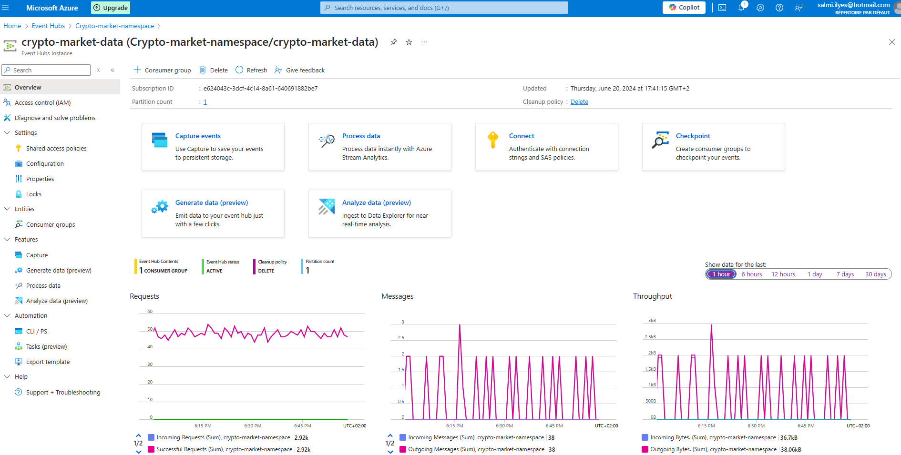
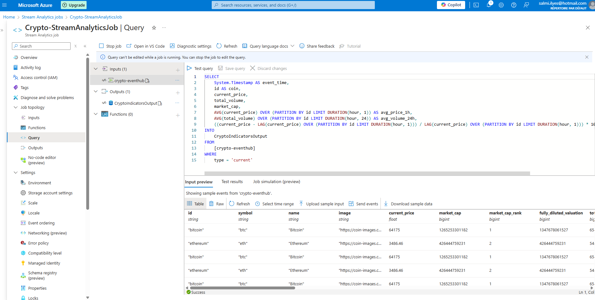
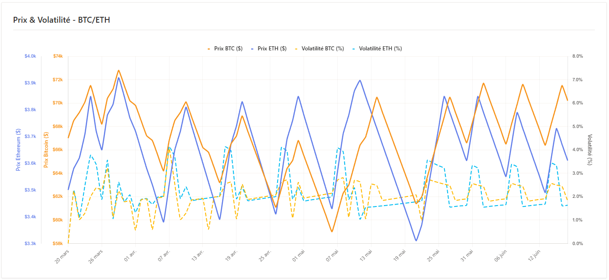

# Analyse Temps Réel du Marché Crypto (Streaming Azure)

   

## 📋 Résumé Exécutif

Ce projet Capstone final vise à construire une architecture **100% Cloud Native (PaaS)** pour l'analyse en temps réel des cryptomonnaies (Bitcoin & Ethereum). Contrairement aux traitements par lots (Batch) classiques, ce projet traite les données "au fil de l'eau" (Streaming) pour permettre une réactivité immédiate.

L'objectif était double :
1.  **Architecture Cloud :** Interconnecter des services Azure managés (Functions, Event Hubs, Stream Analytics) de manière sécurisée et scalable.
2.  **Data Intelligence :** Calculer des indicateurs financiers (Moyennes mobiles, Volatilité) en temps réel et générer des alertes critiques pour les traders.

## 🛠 Architecture Technique (Azure PaaS)

L'architecture repose sur un flux continu de données, orchestré sans aucun serveur à gérer (Serverless).

```mermaid
graph TD
    %% Styles
    classDef source fill:#f9f9f9,stroke:#333,stroke-width:2px;
    classDef ingest fill:#0078D4,stroke:#fff,stroke-width:2px,color:#fff;
    classDef process fill:#E66C37,stroke:#fff,stroke-width:2px,color:#fff;
    classDef storage fill:#004C87,stroke:#fff,stroke-width:2px,color:#fff;
    classDef viz fill:#F2C811,stroke:#fff,stroke-width:2px,color:#000;

    subgraph External ["Source de Données"]
        API["API CoinGecko"]:::source
    end

    subgraph Ingestion ["1. Ingestion Serverless"]
        AzFunc["Azure Function (Timer Trigger)"]:::ingest
        EventHub["Azure Event Hubs (Kafka)"]:::ingest
    end

    subgraph Processing ["2. Traitement Temps Réel"]
        Stream["Azure Stream Analytics"]:::process
    end

    subgraph Storage_Analyze ["3. Stockage & Analyse"]
        Synapse["Azure Synapse SQL Pool"]:::storage
        Monitor["Azure Monitor (Alertes)"]:::storage
    end

    subgraph Viz ["4. Restitution"]
        PBI["Power BI Dashboard"]:::viz
    end

    %% Flux
    API -->|JSON Request (5min)| AzFunc
    AzFunc -->|Push Data| EventHub
    EventHub -->|Ingest Stream| Stream
    Stream -->|Calculs Fenêtrés (SQL)| Synapse
    Synapse -->|Direct Query| PBI
    Stream -.->|Condition Critique| Monitor

    %% Styling
    style External fill:#fff,stroke:#333,color:#000
    style Ingestion fill:#e6f7ff,stroke:#0078D4,color:#000
    style Processing fill:#fff5e6,stroke:#E66C37,color:#000
    style Storage_Analyze fill:#e6efff,stroke:#004C87,color:#000
    style Viz fill:#fff5f0,stroke:#F2C811,color:#000
```

## 💻 Implémentation Data Engineering
### 1. Ingestion Serverless (Python)
J'ai développé une Azure Function déclenchée par un Timer Trigger (toutes les 5 minutes) pour interroger l'API CoinGecko. Le code est conçu pour être résilient aux pannes API.
Voir le code complet : function_app.py
```Python
# Extrait de l'Azure Function
@app.function_name(name="IngestCurrentCryptoData")
@app.schedule(schedule="0 */5 * * * *", ...) 
def ingest_current_crypto_data(myTimer: func.TimerRequest) -> None:
    try:
        url = "https://api.coingecko.com/api/v3/coins/markets?..."
        response = requests.get(url)
        # Envoi direct vers Event Hub via le binding Azure SDK
        event_hub_client.send_batch(batch_data)
        logging.info("Données envoyées avec succès à Event Hub")
    except Exception as e:
        logging.error(f"Erreur critique lors de l'ingestion: {e}")
```

### 2. Traitement de Flux (Stream Analytics SQL)
Le cœur du traitement n'est pas en Python, mais en SQL Temporel. J'ai configuré un job Stream Analytics pour calculer des agrégats sur des fenêtres de temps glissantes (Tumbling Windows).
Requête de transformation (Calcul de Moyennes et Volatilité) :
```SQL
SELECT
    System.Timestamp AS event_time,
    id AS coin,
    AVG(current_price) OVER (PARTITION BY id LIMIT DURATION(hour, 1)) AS avg_price_1h,
    -- Calcul de la volatilité sur fenêtre glissante
    STDEV(current_price) OVER (PARTITION BY id LIMIT DURATION(hour, 24)) AS volatility_24h
INTO
    CryptoIndicatorsOutput -- Vers Synapse Analytics
FROM
    crypto_eventhub
WHERE
    type = 'current'
```

## ⚙️ Administration Cloud & Gouvernance
Ce projet a nécessité une configuration fine des ressources Azure pour assurer la sécurité et la maîtrise des coûts.

### 1. Configuration Infrastructure (IaC & Portail)
Event Hubs : Création d'un Namespace dédié avec partitionnement pour paralléliser l'ingestion si le volume augmente.
Synapse Analytics : Provisionnement d'un Pool SQL dédié (DW) pour stocker l'historique et permettre des requêtes analytiques complexes.

### 2. Monitoring & Alerting (Azure Monitor)
En tant qu'Admin, j'ai mis en place une surveillance active pour réagir aux anomalies de marché sans regarder les écrans :
Règle d'alerte 1 : Si Bitcoin Price > 70,000$ → Envoi Email Équipe Trading.
Règle d'alerte 2 : Si Variation > 5% en 1h (Volatilité extrême) → Notification Critique.

### 3. Gouvernance des Données (Azure Purview)
Pour documenter ce flux de données, j'ai connecté Azure Purview au compte Synapse. Cela permet de :
Scanner automatiquement le schéma des données.
Créer un catalogue de données (Data Catalog) pour que les analystes retrouvent facilement les tables CryptoIndicators.

## 🔧 Défis Techniques & Résolutions (Troubleshooting)
### 🔴 Problème 1 : Latence et "Backpressure"
* Symptôme : Les données arrivaient dans Synapse avec du retard.
* Cause : L'Azure Function envoyait les données une par une, saturant le réseau.
* Solution : Implémentation de l'envoi par Batch (lots) vers Event Hubs pour optimiser le débit.

### 🔴 Problème 2 : Quotas API (Rate Limiting)
* Défi : L'API gratuite de CoinGecko bloque les IP si trop de requêtes.
* Solution : Configuration précise du Timer Trigger (toutes les 5 min) et gestion des erreurs HTTP 429 (Too Many Requests) avec une logique de "retry" (réessai).

### 🔴 Problème 3 : Coûts Azure Synapse
* Défi : Les Pools SQL dédiés coûtent cher s'ils tournent 24/7.
* Solution FinOps : Mise en place d'un script d'automatisation pour "Pauser" le pool Synapse pendant les heures creuses (nuit/weekend) lors des phases de test.


## 📸 Aperçu de la Solution
### Configuration Event Hubs (Ingestion)
Point d'entrée des données streaming.



### Logique de Traitement (Stream Analytics)
Requête SQL temps réel directement dans le portail Azure.



### Visualisation Power BI
Comparaison temps réel Bitcoin vs Ethereum et moyennes mobiles.



### Système d'Alerte
Configuration des seuils critiques dans Azure Monitor.


## 🚀 Compétences Acquises
* Architecture Serverless : Maîtrise des Azure Functions et des triggers événementiels.
* Streaming Data : Compréhension des concepts de fenêtrage temporel avec Stream Analytics.
* Monitoring Avancé : Création d'alertes basées sur des logs et métriques.
* Intégration PaaS : Capacité à connecter des services hétérogènes (API -> Event Hub -> Synapse -> Power BI).
